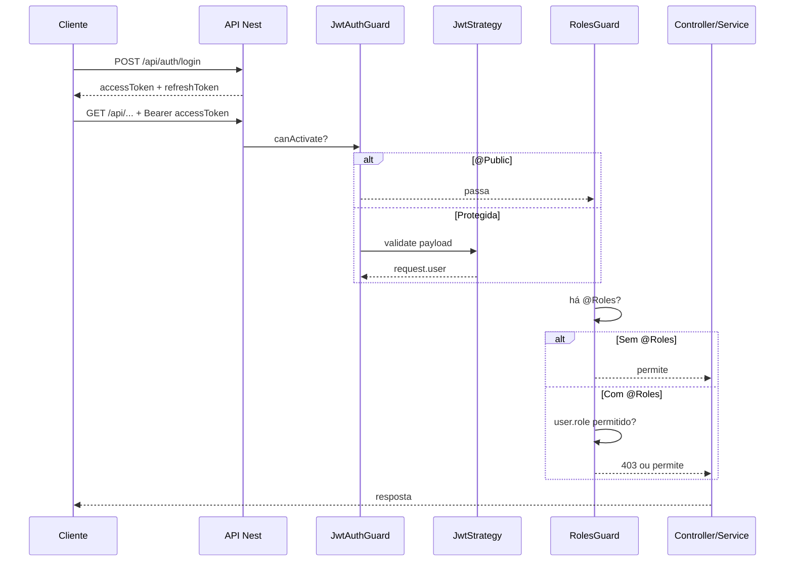

# Guia didático — Autenticação JWT, roles e alinhamento com as regras do projeto

Este documento explica **como funciona** e **como está configurada** a autenticação na **chat-api** (NestJS), incluindo JWT, refresh com rotação, guards globais e papéis (`roles`). Complementa o **`PROJECT-RULES.md`** (regras gerais do repositório) e aponta para **`CHAT-APP-AUTH-INTEGRATION.md`** quando o assunto é o frontend Next.js.

---

## 1. Relação com as regras do projeto (`PROJECT-RULES.md`)

O **`PROJECT-RULES.md`** define a arquitetura geral: prefixo `/api`, Swagger, TypeORM, validação com DTOs, camadas WMS (`http/`, `persistence/`, `dto/`), SOLID e a ideia de **não espalhar segurança dentro dos controllers** — usar **Guards** e serviços dedicados.

A autenticação implementada segue isso assim:

| Regra / princípio | Como a auth o cumpre |
|-------------------|----------------------|
| Guards em vez de lógica solta nos controllers | `JwtAuthGuard` e `RolesGuard` são globais; controllers só declaram `@Public()` ou `@Roles(...)` quando necessário. |
| Validação de entrada | DTOs em `auth/http/dto/` com `class-validator` + Swagger. |
| Um módulo por domínio | `AuthModule` em `src/modules/auth/` (paralelo a `wms`, `chat`, `llm`). |
| Config por ambiente | `JWT_SECRET`, `JWT_ACCESS_EXPIRES_IN`, `JWT_REFRESH_EXPIRES_IN`, `JWT_REFRESH_SECRET` opcional — ver `.env.example`. |
| Documentação API | `AuthController` documentado com `@ApiTags('auth')`; Swagger com esquema Bearer `access-token` em `swagger.setup.ts`. |

Para a lista completa de convenções (pastas WMS, SOLID, o que evitar), consulta sempre o **`PROJECT-RULES.md`**.

---

## 2. Conceitos rápidos (antes do código)

### Autenticação vs autorização

- **Autenticação:** “Quem és?” — login com `code` + `password`, emissão de tokens.
- **Autorização:** “O que podes fazer?” — o campo `role` no token e o `RolesGuard` decidem se podes aceder a rotas marcadas com `@Roles(...)`.

### Dois JWT: access e refresh

| Token | Função típica | Vida útil (exemplo) | Onde guardar no cliente |
|-------|-----------------|---------------------|-------------------------|
| **Access** | Enviado em `Authorization: Bearer ...` em cada pedido REST; também no handshake Socket.IO `auth.token` | Curta (`JWT_ACCESS_EXPIRES_IN`, ex. `5m`) | Memória ou storage conforme política do front |
| **Refresh** | Só para chamar `POST /api/auth/refresh` e obter **novo par** | `JWT_REFRESH_EXPIRES_IN` (em teste defeito `10m`; produção típico `7d`) | Storage seguro conforme política do front |

**Rotação do refresh:** cada refresh válido **revoga** o token usado na base de dados e emite **outro** refresh. Assim, um refresh roubado deixa de funcionar depois de um refresh legítimo.

---

## 3. Variáveis de ambiente relevantes

| Variável | Papel |
|----------|--------|
| `JWT_SECRET` | Assinatura e verificação do **access** token (e default do refresh se não houver `JWT_REFRESH_SECRET`). |
| `JWT_REFRESH_SECRET` | Opcional; se definida, assina apenas o **refresh** (recomendado em produção). |
| `JWT_ACCESS_EXPIRES_IN` | Expiração do access (ex. `5m`; override livre via env). |
| `JWT_REFRESH_EXPIRES_IN` | Expiração do refresh; se omitida, vale o defeito em `AuthService.getRefreshExpiresIn()` (consultar código — em testes pode ser `10m`, em produção costuma ser `7d`). |
| `GOOGLE_API_KEY` | Não é da auth; usada por LLM/RAG (não confundir). |

Credenciais de **desenvolvimento** após `yarn seed` estão descritas no `.env.example` e no final deste guia.

---

## 4. Mapa de ficheiros do módulo `auth`

```
src/modules/auth/
├── auth.module.ts                 # Módulo Nest: JWT, Passport, TypeORM, exports
├── persistence/
│   └── auth-refresh-token.orm-entity.ts   # Tabela auth_refresh_tokens (jti, user, expiração, revogação)
├── strategies/
│   └── jwt.strategy.ts            # Passport: extrai Bearer, valida payload, carrega utilizador na BD
├── guards/
│   ├── jwt-auth.guard.ts          # Global: exige JWT salvo exceções @Public
│   └── roles.guard.ts             # Global: exige role se houver @Roles
├── decorators/
│   ├── public.decorator.ts        # @Public() — rota sem JWT
│   ├── roles.decorator.ts         # @Roles(WmsUserRole.ADMIN, ...)
│   └── current-user.decorator.ts  # @CurrentUser() — lê request.user no handler
├── interfaces/
│   ├── access-jwt-payload.interface.ts   # { sub, role } no access token
│   ├── refresh-jwt-payload.interface.ts  # { sub, jti, typ: 'refresh' }
│   └── authenticated-user.interface.ts   # request.user após strategy
└── http/
    ├── auth.controller.ts         # login, refresh, logout
    ├── auth.service.ts            # bcrypt, sign JWT, revogar refresh, rotação
    └── dto/                       # LoginRequestDto, RefreshRequestDto, AuthTokensResponseDto
```

O **enum de papéis** vive no WMS partilhado (domínio comum ao utilizador e à API):

`src/modules/wms/shared/domain/wms-user-role.enum.ts` — `VIEWER`, `OPERATOR`, `ADMIN`.

---

## 5. Modelo de dados (para que serve cada parte)

### `WmsUserOrmEntity` (`wms_users`)

- **`code`** — Identificador de login (único), alinhado ao operador WMS.
- **`passwordHash`** — Hash **bcrypt** da palavra-passe; `null` significa “ainda não pode fazer login pela API”.
- **`role`** — Papel RBAC (`VIEWER` | `OPERATOR` | `ADMIN`).
- **`active`** — Se `false`, a `JwtStrategy` rejeita o token mesmo que a assinatura seja válida.

### `AuthRefreshTokenOrmEntity` (`auth_refresh_tokens`)

- **`jti`** — ID único do refresh (claim no JWT de refresh); chave primária.
- **`user` / `userId`** — Dono do token; `ON DELETE CASCADE` remove tokens se o utilizador for apagado.
- **`expiresAt`** — Coerente com o `exp` do JWT; validação extra na BD.
- **`revokedAt`** — Preenchido em logout ou na rotação; token revogado não volta a ser aceite.

---

## 6. `AuthModule` — configuração Nest

**Para que serve:** registar tudo o que a autenticação precisa num único sítio e **exportar** `JwtModule` e `PassportModule` para outros módulos (ex.: **Chat** usa o mesmo `JwtService` e segredo).

Pontos principais:

1. **`TypeOrmModule.forFeature([WmsUserOrmEntity, AuthRefreshTokenOrmEntity])`** — Repositórios injetáveis no `AuthService` e na `JwtStrategy`.
2. **`PassportModule.register({ defaultStrategy: 'jwt' })`** — Estratégia nomeada `'jwt'` usada pelo `AuthGuard('jwt')`.
3. **`JwtModule.registerAsync`** — Lê `JWT_SECRET` e `JWT_ACCESS_EXPIRES_IN` do `ConfigService` (valores por defeito seguros para dev).

Também regista **`JwtAuthGuard`** e **`RolesGuard`** como providers e **exporta-os** para o `AppModule` poder registá-los como `APP_GUARD`.

---

## 7. `AuthController` e DTOs HTTP

**Para que serve:** expor as rotas REST sem lógica de negócio — só delegam no `AuthService`.

| Rota | Decorator | Função |
|------|-----------|--------|
| `POST /api/auth/login` | `@Public()` | Corpo: `code`, `password` → devolve `accessToken`, `refreshToken`, metadados. |
| `POST /api/auth/refresh` | `@Public()` | Corpo: `refreshToken` → valida, revoga esse refresh, devolve **novo par**. |
| `POST /api/auth/logout` | `@Public()` | Corpo: `refreshToken` → revoga na BD; token inválido não gera erro (evita enumeração). |

Os **DTOs** em `http/dto/` garantem validação (`class-validator`) e documentação Swagger, em linha com a secção HTTP do `PROJECT-RULES.md`.

---

## 8. `AuthService` — funções e motivo de cada uma

### `login(dto)`

1. Procura utilizador por `code`.
2. Verifica `active`, existência de `passwordHash`.
3. **`bcrypt.compare`** com a password em claro.
4. Em caso de falha, mensagem genérica **“Credenciais inválidas”** (não revelar se o código existe).

**Porquê:** boa prática de segurança e simplicidade para o cliente.

### `refresh(dto)`

1. Verifica o JWT de refresh com **`JWT_REFRESH_SECRET`** ou `JWT_SECRET`.
2. Confirma `typ === 'refresh'`.
3. Carrega a linha `auth_refresh_tokens` por `jti` + utilizador; exige não revogada e não expirada.
4. Confirma que o utilizador ainda existe e está ativo.
5. Marca o refresh atual como revogado e chama **`issueTokenPair`** (rotação).

**Porquê:** limitar janela de abuso se um refresh for copiado.

### `logout(dto)`

Tenta validar o refresh; se falhar, **retorna sem erro**. Se for válido, marca `revokedAt`.

**Porquê:** logout idempotente e sem dar informação a terceiros.

### `getRefreshSecret()` / `getAccessExpiresIn()` / `getRefreshExpiresIn()`

Leitura centralizada da configuração (incluindo fallback do segredo de refresh).

### `issueTokenPair(user)` (privado)

- Assina **access** com payload `{ sub: user.id, role: user.role }` usando o segredo e TTL do access.
- Gera **`jti`**, assina **refresh** com `{ sub, jti, typ: 'refresh' }` usando segredo de refresh.
- Grava linha em **`auth_refresh_tokens`** com `expiresAt` alinhado ao `exp` do JWT.
- Devolve DTO de resposta para o cliente.

**Porquê:** um único sítio para criar sempre par consistente (login e refresh).

---

## 9. `JwtStrategy` (Passport)

**Para que serve:** depois do Passport validar assinatura e expiração do access token, o método **`validate(payload)`** corre na tua aplicação:

1. Garante `sub` válido.
2. Carrega o utilizador na BD pelo `id`.
3. Garante que está **ativo**.
4. Compara **`user.role` com `payload.role`** — se na BD mudaste o papel, tokens antigos deixam de servir.

O retorno `{ userId, role }` é colocado em **`request.user`** (tipo `AuthenticatedUser`).

**Porquê:** não confiar só no JWT; o estado atual da BD (ativo, role) manda.

---

## 10. Guards globais (`app.module.ts`)

```text
APP_GUARD → JwtAuthGuard  (primeiro na prática: autentica)
APP_GUARD → RolesGuard    (depois: autoriza se houver @Roles)
```

### `JwtAuthGuard`

- Estende `AuthGuard('jwt')` (Passport).
- Usa **`Reflector`** para ler `@Public()`: se a rota for pública, **não** corre a estratégia JWT.
- Normaliza o retorno de `canActivate` (Promise / Observable) para funcionar bem com o Nest 11.

### `RolesGuard`

- Lê metadados **`@Roles(...)`**.
- Se **não** houver roles definidos → **deixa passar** (basta estar autenticado, se o JWT guard já passou).
- Se houver roles → exige `request.user.role` na lista; caso contrário **`403 Forbidden`** (não 401).

**Exemplo no projeto** — só administradores na rota de integrações:

- Ficheiro: `src/modules/wms/integrations/http/integrations.controller.ts`
- Decorators: `@ApiBearerAuth('access-token')`, `@Roles(WmsUserRole.ADMIN)`

Isto demonstra o padrão: **documentação Swagger** + **regra de papel** à entrada do controller.

---

## 11. Decorators auxiliares

| Decorator | Função |
|-----------|--------|
| `@Public()` | Marca handler ou classe como isento de JWT (health, auth, dev-token). |
| `@Roles(...)` | Lista de `WmsUserRole` permitidos para esse handler/classe. |
| `@CurrentUser()` | Injeta `AuthenticatedUser` no parâmetro do método (útil para auditoria ou lógica por utilizador). |

---

## 12. Swagger (`swagger.setup.ts`)

- **`addBearerAuth(..., 'access-token')`** — Define o esquema de segurança no OpenAPI.
- Nos controllers protegidos podes usar **`@ApiBearerAuth('access-token')`** para o UI do Swagger mostrar o cadeado e o botão “Authorize”.

O texto da descrição indica que o token vem de **`/api/auth/login`** ou **`/api/auth/refresh`**.

---

## 13. Chat (WebSocket) e JWT

O **HTTP** usa Passport (`JwtStrategy`). O **Socket.IO** no namespace `/chat` **não** passa pelos mesmos guards; o **`ChatGateway`** usa **`JwtService.verify`** diretamente no handshake e exige um **`sub`** válido no payload.

- **`ChatModule`** importa **`AuthModule`** para reutilizar o **mesmo** `JwtModule` (mesmo segredo e TTL do access).
- **`ChatDevTokenController`** está marcado com **`@Public()`** e, quando `CHAT_DEV_TOKEN_ENDPOINT=true`, emite um JWT de teste com `role: ADMIN` (útil para Swagger/socket em dev; o `sub` por defeito não é um UUID de utilizador real — para REST com strategy completa usa login normal).

---

## 14. Seed e utilizadores de teste

O **`DatabaseSeedService`**:

- Inclui **`auth_refresh_tokens`** no `TRUNCATE` para limpar sessões ao repor dados.
- Cria utilizadores com `passwordHash: null` e `role: OPERATOR` por defeito.
- Chama **`applySeedLoginUsers()`** para três contas com a mesma palavra-passe de dev e papéis distintos (**ADMIN**, **OPERATOR**, **VIEWER**) — ver comentários no código e `.env.example`.

**Para que serve:** testar login, refresh e **403** na rota de integrações com `VIEWER` sem configurar dados à mão.

---

## 15. Fluxo mental (resumo)



---

## 16. Documentos relacionados

| Ficheiro | Conteúdo |
|----------|----------|
| `PROJECT-RULES.md` | Regras globais do repositório, WMS, SOLID, HTTP, segurança (resumo). |
| `CHAT-APP-AUTH-INTEGRATION.md` | Passo a passo para integrar o frontend Next.js (chat-app). |
| `.env.example` | Variáveis JWT e credenciais de exemplo pós-seed. |

---

## 17. Boas práticas ao estender a auth

1. **Novas rotas públicas** — Não esquecer `@Public()` (senão o guard global bloqueia).
2. **Novas rotas só para alguns papéis** — Usar `@Roles(...)` no controller; manter regras finas de negócio (ex.: “só edita o seu recurso”) no **service**.
3. **Não expor `passwordHash`** em DTOs de resposta WMS — o mapa para `WmsUserResponseDto` não inclui esse campo.
4. **Produção** — `JWT_REFRESH_SECRET` distinta, segredos fortes, `DB_SYNC=false` com migrations, e rever tempos de expiração.

---

*Documento em português do Brasil, alinhado à implementação atual em `src/modules/auth` e às regras em `PROJECT-RULES.md`.*
