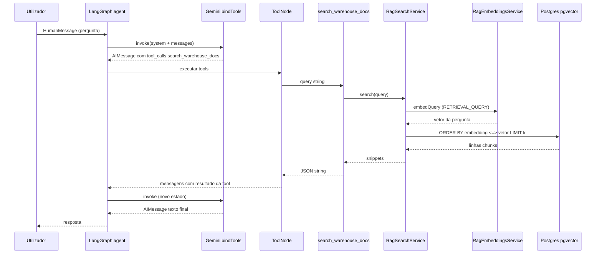
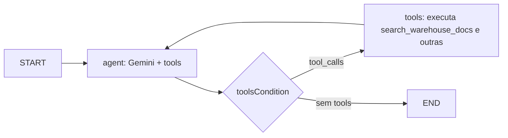

# Uso dos dados vetoriais pelo agente (LangGraph + RAG)

Documentação didática: **como** o assistente WMS acede aos chunks já indexados em Postgres (`pgvector`), **em que momento** isso acontece e **que ficheiros** participam no fluxo.

> **Relação com o ingest:** o pipeline `rag:ingest` **grava** embeddings na tabela `rag_document_chunks`. Este documento explica a **leitura** desses vetores durante o **chat**, quando o modelo decide usar a ferramenta de busca semântica.

---

## 1. Ideia central: não há um `if` “é RAG” no código

A decisão de usar a documentação indexada **não** é uma regra fixa em TypeScript (tipo “se a mensagem contém X, chama o RAG”). O fluxo é **tool calling**:

1. O modelo Gemini recebe uma **lista de ferramentas** (tools), entre elas a busca na documentação.
2. Consoante a **pergunta do utilizador**, o **próprio modelo** escolhe se deve invocar `search_warehouse_docs` (e com que texto de consulta).
3. O LangGraph executa a tool, o resultado volta à conversa, e o modelo **gera a resposta final** com base nos trechos devolvidos.

Ou seja: o “momento” em que se usam os dados vetoriais é quando o LLM emite um **pedido de ferramenta** (`tool_calls`) para `search_warehouse_docs`.

---

## 2. Onde o agente é montado (entrada do RAG no grafo)

**Ficheiro:** `src/modules/llm/services/llm-agent.service.ts`

No `onModuleInit`, criam-se as tools de produto, lookups WMS e **RAG**; todas são passadas ao construtor do grafo:

```typescript
const ragTools = createRagTools(this.ragSearchService);
const allTools = [...productTools, ...wmsLookupTools, ...ragTools];
this.graph = buildWmsChatGraph(this.model, allTools);
```

- **`RagSearchService`** é injetado no serviço e só é acedido **dentro** da implementação da tool `search_warehouse_docs` (ver `create-rag-tools.ts`).
- Cada pedido de chat chama `this.graph.invoke({ messages: [...] })` — o grafo é o mesmo para todas as mensagens; o que muda é o conteúdo e as decisões do modelo.

---

## 3. A ferramenta que “liga” o modelo ao Postgres

**Ficheiro:** `src/modules/rag/tools/create-rag-tools.ts`

| Elemento | Significado |
|----------|-------------|
| **Nome** | `search_warehouse_docs` — é o identificador que o modelo usa nas `tool_calls`. |
| **Descrição** | Texto mostrado ao modelo: quando usar (procedimentos, políticas, fluxos) e quando **não** usar (dados em tempo real → outras tools). |
| **Input** | `query: string` — consulta curta em português para **busca semântica** (não é SQL). |
| **Implementação** | Chama `ragSearchService.search(trimmed)` e devolve **JSON** com `snippets` (`text`, `source`, `chunkIndex`, `distance`). |

O modelo **não** escreve SQL: só escolhe a tool e o parâmetro `query`. O backend transforma isso em embedding + pesquisa vetorial.

---

## 4. LangGraph: nós `agent` ↔ `tools`

**Ficheiro:** `src/modules/llm/graph/wms-chat.graph.ts`

```typescript
const modelWithTools = model.bindTools(tools);
const toolNode = new ToolNode(tools);

const agent = async (state) => {
  const response = await modelWithTools.invoke([
    new SystemMessage(WMS_CHAT_SYSTEM_PROMPT),
    ...state.messages,
  ]);
  return { messages: [response] };
};

new StateGraph(MessagesAnnotation)
  .addNode('agent', agent)
  .addNode('tools', toolNode)
  .addEdge(START, 'agent')
  .addConditionalEdges('agent', toolsCondition, ['tools', END])
  .addEdge('tools', 'agent')
  .compile();
```

Fluxo em palavras:

1. **`agent`** — Gemini com system prompt + histórico; pode responder só em texto **ou** pedir execução de uma ou mais tools.
2. **`toolsCondition`** — Se existirem `tool_calls`, o grafo vai ao nó **`tools`**; caso contrário termina (`END`).
3. **`tools`** — O `ToolNode` executa cada tool (incluindo `search_warehouse_docs`); os resultados entram nas mensagens como **ToolMessage** (ou equivalente).
4. Volta ao **`agent`** para o modelo **ler** os resultados e produzir a mensagem final ao utilizador.

Pode haver **várias voltas** agente → ferramentas → agente (por exemplo várias tools, ou o modelo pedir mais informação). O limite de recursão está definido na invocação (`recursionLimit` em `llm-agent.service.ts`).

---

## 5. Como o modelo “sabe” que deve usar o banco vetorial

Três influências combinadas:

### 5.1 Descrição da tool

O texto em `description` em `create-rag-tools.ts` explica o **papel** da tool (documentação interna vs dados em tempo real). O Gemini usa isso para decidir entre `search_warehouse_docs` e, por exemplo, `get_product_by_barcode`.

### 5.2 Prompt de sistema

**Ficheiro:** `src/modules/llm/llm.constants.ts` — constante `WMS_CHAT_SYSTEM_PROMPT`

Há uma linha explícita a dizer para usar **`search_warehouse_docs`** para documentação e procedimentos, e para combinar com ferramentas de dados quando forem precisos IDs ou valores em tempo real.

### 5.3 Contexto da conversa

Perguntas de seguimento e o histórico em `state.messages` também orientam a escolha das tools.

**Importante:** não existe no repositório um classificador separado (“intent = RAG”). A política é **100 % decidida pelo modelo** através do esquema de tools + prompt.

---

## 6. Do parâmetro `query` à consulta no Postgres

**Ficheiro:** `src/modules/rag/services/rag-search.service.ts`

Passos:

1. **`embeddings.embedQuery(query)`** — gera o vetor da **pergunta** com o modo adequado a consultas (`TaskType.RETRIEVAL_QUERY` em `RagEmbeddingsService`). Isto é **distinto** do embedding de **documentos** usado no ingest (`RETRIEVAL_DOCUMENT`), para alinhar com as boas práticas “documento vs query”.
2. **`chunks.searchByEmbeddingSimilarity(vector, limit)`** — SQL em `RagChunkRepository`: ordenação por distância (`<=>`) e `LIMIT` (por defeito `RAG_DEFAULT_TOP_K` em `rag.constants.ts`, com possível override `RAG_TOP_K` no ambiente, até teto 32).
3. Os registos devolvidos são os **mesmos** `content` / `embedding` que foram gravados no ingest; só se compara o vetor da **pergunta** com os vetores dos **chunks** indexados.

---

## 7. O que o modelo recebe de volta

A tool devolve uma **string JSON** com `snippets`: cada item tem o **texto do chunk**, **caminho do ficheiro fonte**, **índice do chunk** e **distância** (quão “perto” está no espaço vetorial).

O modelo usa esse texto como **evidência** para redigir a resposta. Não há um segundo passo automático de “citação obrigatória” no código — a forma como cita ou resume depende do prompt e do comportamento do LLM.

---

## 8. Diagrama do fluxo (chat → vetores → resposta)



Fluxo simplificado em grafo:



---

## 9. Ficheiros relevantes (leitura / agente)

| Ficheiro | Papel |
|----------|--------|
| `src/modules/llm/services/llm-agent.service.ts` | Monta tools, compila o grafo, `invoke` no chat |
| `src/modules/llm/graph/wms-chat.graph.ts` | Definição LangGraph: `agent`, `tools`, `toolsCondition` |
| `src/modules/llm/llm.constants.ts` | `WMS_CHAT_SYSTEM_PROMPT` (inclui instrução para `search_warehouse_docs`) |
| `src/modules/rag/tools/create-rag-tools.ts` | Tool `search_warehouse_docs` → `RagSearchService` |
| `src/modules/rag/services/rag-search.service.ts` | `embedQuery` + pesquisa por similaridade |
| `src/modules/rag/services/rag-embeddings.service.ts` | `embedQuery` vs `embedDocuments` (task types) |
| `src/modules/rag/persistence/rag-chunk.repository.ts` | `searchByEmbeddingSimilarity` (SQL + `vector`) |
| `src/modules/rag/rag.constants.ts` | `RAG_DEFAULT_TOP_K`, defaults de modelo embedding |

---

## 10. Ingest vs chat (resumo)

| Aspeto | Ingest (`rag:ingest`) | Chat (agente) |
|--------|------------------------|----------------|
| Objetivo | Indexar Markdown | Responder ao utilizador |
| Embedding | Por **chunk de documento** (`RETRIEVAL_DOCUMENT`) | Por **pergunta** (`RETRIEVAL_QUERY`) |
| Escrita na BD | `INSERT` em `rag_document_chunks` | Não grava chunks; só **lê** |
| Gatilho | Comando CLI / pipeline | Tool calling do Gemini |

---

## Resumo numa frase

O agente **não** acede ao pgvector diretamente: acede à tool **`search_warehouse_docs`**, que chama **`RagSearchService`**, que **embebe a pergunta**, faz **busca por similaridade** sobre os vetores já guardados e devolve **trechos de texto** ao modelo, que então **formula a resposta** — e o **momento** em que isso acontece é quando o LangGraph executa essa tool porque o **próprio modelo** a pediu.
