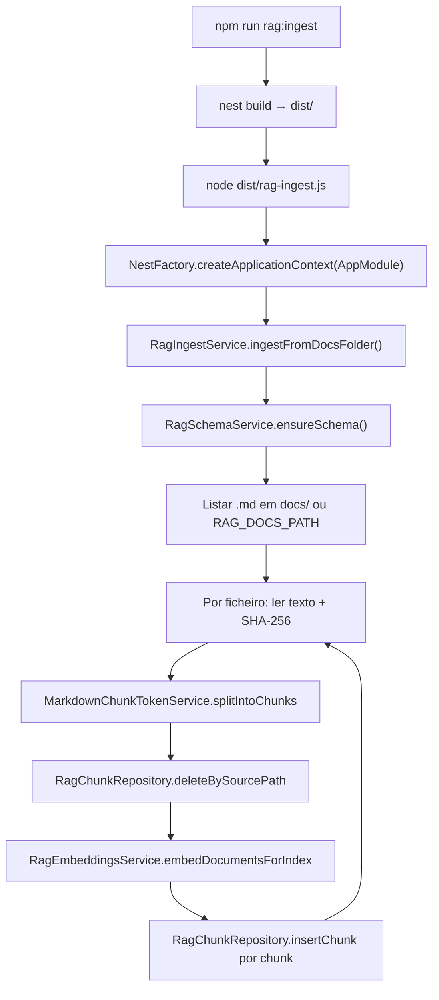

# Pipeline `rag:ingest` — documentação para chunks e Postgres

Explicação passo a passo: **ficheiros**, **fluxo de execução** e **definição** de como os `.md` são lidos, partidos em chunks, convertidos em embeddings e gravados na base.

---

## 1. Onde começa o comando

No `package.json`, o script **`rag:ingest`** compila o Nest e corre um ficheiro Node à parte:

- **`nest build`** → gera `dist/`
- **`node dist/rag-ingest.js`** → ponto de entrada da CLI

Ou seja: **não é o servidor HTTP**; é um **processo único** que sobe o Nest só como **contexto de injeção de dependências** (sem escutar porta).

```bash
npm run rag:ingest
```

---

## 2. Ponto de entrada da CLI

**Ficheiro:** `src/rag-ingest.ts`

```typescript
async function bootstrap(): Promise<void> {
  const logger = new Logger('RagIngestCli');
  const app = await NestFactory.createApplicationContext(AppModule, {
    logger: ['error', 'warn', 'log'],
  });
  try {
    const ingest = app.get(RagIngestService);
    const result = await ingest.ingestFromDocsFolder();
    logger.log(
      `Concluído: ficheiros=${result.filesProcessed}, chunks=${result.chunksWritten}`,
    );
  } finally {
    await app.close();
  }
}
```

**O que acontece:**

1. Carrega **`AppModule`** (com **`RagModule`** registado).
2. Pede ao container o **`RagIngestService`**.
3. Chama **`ingestFromDocsFolder()`** — é ali que está toda a lógica de leitura, chunk, embedding e gravação.
4. Fecha a aplicação.

---

## 3. Quem entra em cena (definição / DI)

**Ficheiro:** `src/modules/rag/rag.module.ts`

Regista os serviços que o ingest precisa:

| Provider | Papel |
|----------|--------|
| `RagSchemaService` | Extensão `vector`, tabela `rag_document_chunks` |
| `RagEmbeddingsService` | Gemini (LangChain) — vetores dos textos |
| `GeminiTokenService` | Contagem de tokens (chunking) |
| `MarkdownChunkTokenService` | Divide cada `.md` em chunks |
| `RagChunkRepository` | `DELETE` / `INSERT` no Postgres |
| `RagIngestService` | Orquestra tudo |

O **`AppModule`** importa o **`RagModule`**, por isso estes providers existem quando a CLI arranca.

---

## 4. Fluxo dentro de `ingestFromDocsFolder`

**Ficheiro:** `src/modules/rag/services/rag-ingest.service.ts`

Resumo em “história”:

### `ensureSchema()` (`RagSchemaService`)

- Garante extensão **`vector`** no Postgres.
- Descobre a **dimensão** do embedding (probe na API Gemini ou `RAG_VECTOR_DIMENSIONS`).
- Cria a tabela **`rag_document_chunks`** se não existir; se a dimensão do vetor na tabela antiga for diferente, **dropa e recria** (ver `rag-schema.service.ts`).

### Pasta dos docs

- `path.resolve(process.cwd(), RAG_DOCS_PATH ?? 'docs')` — por defeito a pasta **`docs/`** na raiz do projeto (relativamente ao diretório de trabalho onde corres o `npm run`).

### Listar ficheiros

- `walkDir` recursivo → só ficheiros **`.md`**, ordenados.

### Por cada ficheiro

1. Lê o texto UTF-8.
2. Calcula **`contentHash`** (SHA-256 do ficheiro inteiro) — fica guardado em cada linha para saberes “de que versão do doc” veio o chunk.
3. **`chunker.splitIntoChunks(raw)`** → lista de pedaços com texto + `chunkIndex`.
4. **`deleteBySourcePath(relativePath)`** → apaga chunks antigos **daquele ficheiro** (reindexação limpa por origem).
5. Se não sobrou nenhum chunk, regista e segue.
6. **`embeddings.embedDocumentsForIndex(texts)`** → chama a API Gemini com **task type document** e devolve **um vetor por chunk**.
7. Valida se a dimensão bate com a esperada.
8. **`insertChunk`** uma vez por chunk: `source_path`, `chunk_index`, `content`, `content_hash`, `embedding`.

### Trecho central do loop

```typescript
async ingestFromDocsFolder(): Promise<{ filesProcessed: number; chunksWritten: number }> {
  await this.schema.ensureSchema();
  const docsRoot = path.resolve(
    process.cwd(),
    this.config.get<string>('RAG_DOCS_PATH') ?? 'docs',
  );
  // ...
  for (const absolutePath of files) {
    const relativePath = path
      .relative(docsRoot, absolutePath)
      .replace(/\\/g, '/');
    const raw = await fs.readFile(absolutePath, 'utf8');
    const contentHash = createHash('sha256').update(raw).digest('hex');
    const pieces = await this.chunker.splitIntoChunks(raw);
    await this.chunks.deleteBySourcePath(relativePath);
    // ...
    const vectors = await this.embeddings.embedDocumentsForIndex(texts);
    // ...
    await this.chunks.insertChunk({
      sourcePath: relativePath,
      chunkIndex: pieces[i].chunkIndex,
      content: pieces[i].content,
      contentHash,
      embedding: v,
    });
  }
}
```

---

## 5. Chunking (onde o Markdown vira “pedaços”)

**Ficheiro:** `src/modules/rag/services/markdown-chunk-token.service.ts`

- Usa **`GeminiTokenService`** para respeitar um **máximo de tokens** por chunk (`rag.constants.ts` — proporção do limite do modelo de embedding).
- Estratégia: secções **`##`**, depois **`###`** se preciso, **tabelas/código atómicos**, merge de fragmentos pequenos, **overlap** entre chunks.

O ingest **só** chama `splitIntoChunks(textoCompletoDoFicheiro)`; não conhece os detalhes — ficam encapsulados no chunker.

---

## 6. Embeddings (vetores)

**Ficheiro:** `src/modules/rag/services/rag-embeddings.service.ts`

- LangChain **`GoogleGenerativeAIEmbeddings`** com modelo configurável (`GEMINI_EMBEDDING_MODEL` no ambiente, ou default **`DEFAULT_GEMINI_EMBEDDING_MODEL`** em `rag.constants.ts`, tipicamente `gemini-embedding-001`).
- Para indexação usa **`TaskType.RETRIEVAL_DOCUMENT`** — alinhado ao uso “documento a indexar” vs “pergunta” na busca.

---

## 7. Persistência no Postgres

**Ficheiro:** `src/modules/rag/persistence/rag-chunk.repository.ts`

- **`deleteBySourcePath`**: `DELETE FROM rag_document_chunks WHERE source_path = $1`
- **`insertChunk`**: `INSERT` com `embedding` como literal `::vector`

**Schema** criado em **`RagSchemaService`**: tabela **`rag_document_chunks`** com colunas como `source_path`, `chunk_index`, `content`, `content_hash`, `embedding vector(N)`, etc.

---

## 8. Diagrama do fluxo (execução)



---

## 9. Lista rápida de ficheiros do pipeline ingest

| Ficheiro | Função |
|----------|--------|
| `package.json` | Script `rag:ingest` |
| `src/rag-ingest.ts` | CLI: arranca Nest e chama o serviço |
| `src/app.module.ts` | Importa `RagModule` |
| `src/modules/rag/rag.module.ts` | Regista providers RAG |
| `src/modules/rag/services/rag-ingest.service.ts` | Orquestra leitura → chunk → embed → SQL |
| `src/modules/rag/services/rag-schema.service.ts` | Extensão `vector` + tabela |
| `src/modules/rag/services/markdown-chunk-token.service.ts` | Chunking por tokens |
| `src/modules/rag/services/gemini-token.service.ts` | Contagem de tokens (usada pelo chunker) |
| `src/modules/rag/services/rag-embeddings.service.ts` | Embeddings Gemini |
| `src/modules/rag/persistence/rag-chunk.repository.ts` | `DELETE` / `INSERT` |
| `src/modules/rag/rag.constants.ts` | Limites de tokens, overlap, default do modelo de embedding, etc. |

---

## Resumo numa frase

O **`rag:ingest`** sobe o Nest **sem HTTP**, o **`RagIngestService`** lê todos os `.md` da pasta configurada, **parte** cada um em chunks, **apaga** os chunks antigos daquele caminho, **gera embeddings** no Gemini e **insere** linha a linha na tabela **`rag_document_chunks`** no Postgres.
